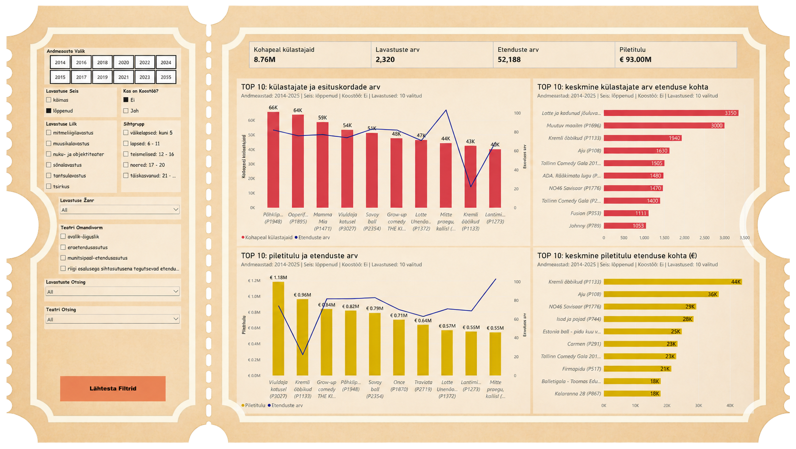
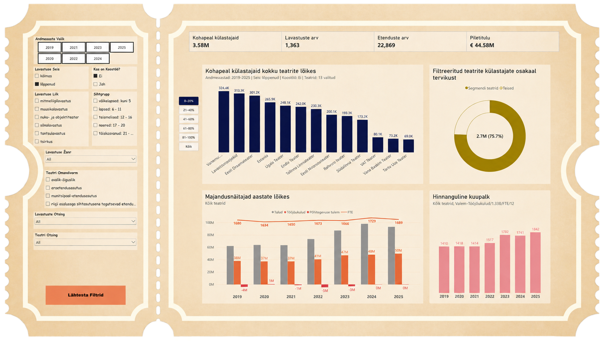
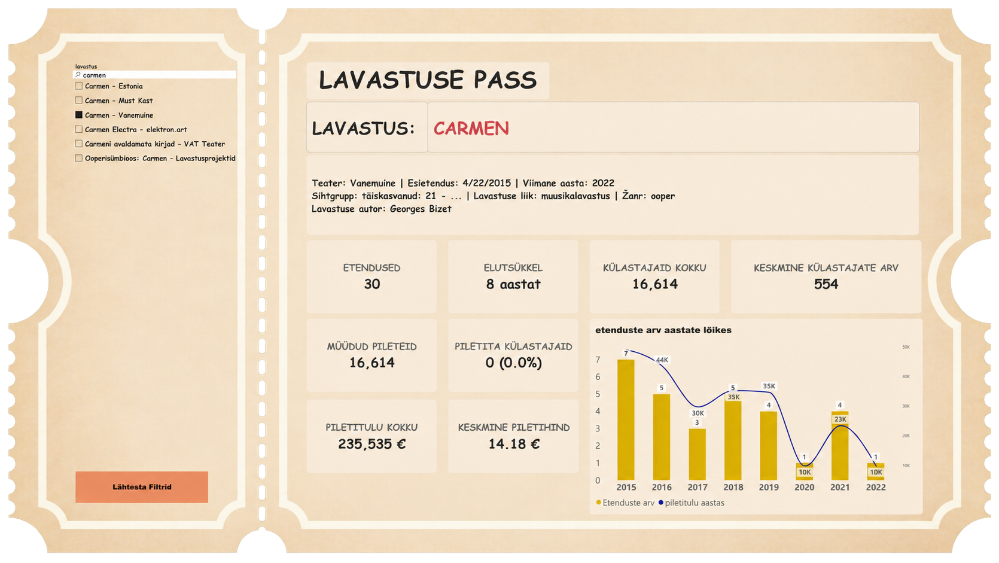
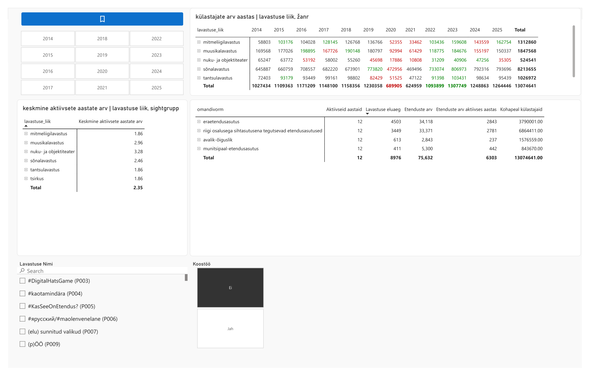
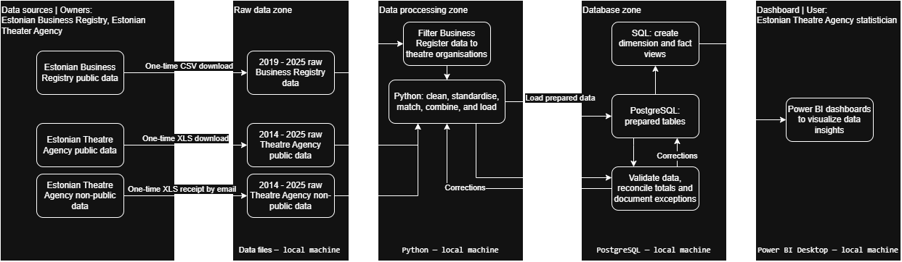
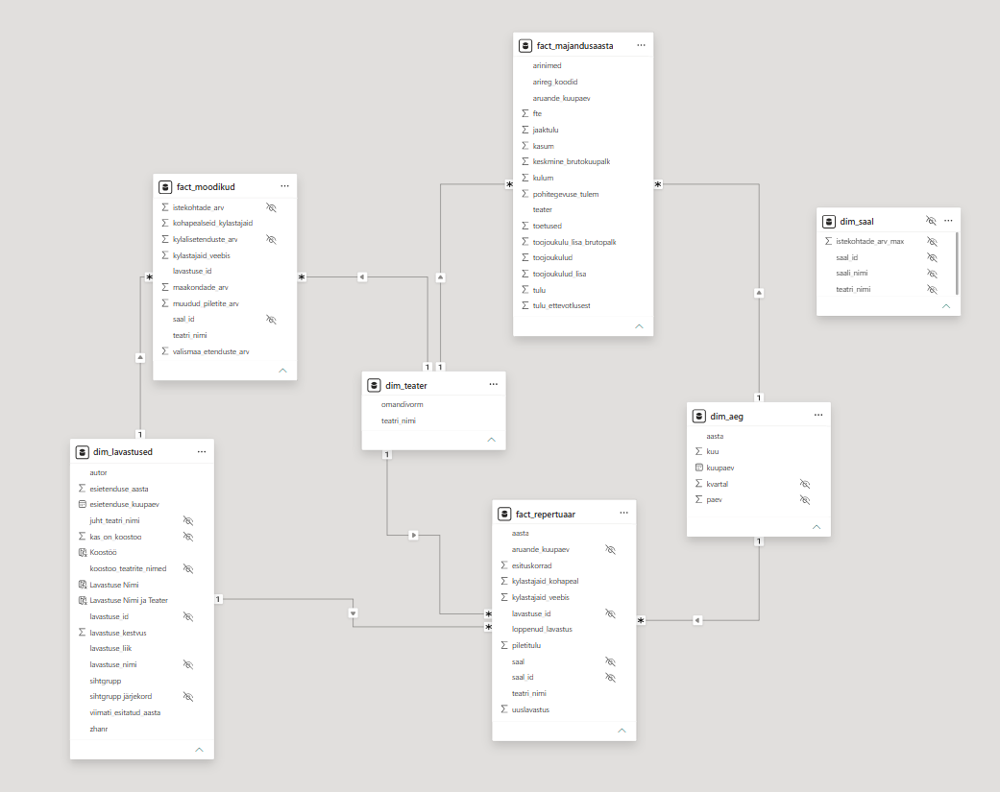

# Estonian Theatre Data Analysis, 2014–2025

An analysis of Estonian theatre productions, their lifespan, and performance activity using **Python**, **PostgreSQL**, and **Power BI**.

Developed as a group final project for the [BCS data analysis microqualification](https://vali-it.ee/andmetarkus).

## Team

| Team member | Contribution | Email | LinkedIn |
|---|---|---|---|
| Hannes Ruusmaa | Project managment and Data engineering; Python, SQL, and Power BI | [hannes.ruusmaa@gmail.com](mailto:hannes.ruusmaa@gmail.com) | [Profile](https://www.linkedin.com/in/hannes-ruusmaa-3b7090223/) |
| Jandra Mölder | Project documentation and visualisation; Power BI | [jandramolder81@gmail.com](mailto:jandramolder81@gmail.com) | [Profile](https://www.linkedin.com/in/jandra-m%C3%B6lder-4b4361371/) |
| Raul Sõrmus | Data engineering; Python, SQL, and Power BI | [raul.sormus@icloud.com](mailto:raul.sormus@icloud.com) | [Profile](https://www.linkedin.com/in/raulsormus/) |
| Vesta Väljan | Data organisation; Python, SQL, and Power BI | [vestavaljan@gmail.com](mailto:vestavaljan@gmail.com) | [Profile](https://www.linkedin.com/in/vesta-v%C3%A4ljan-660950303/) |

## Contents

- [Team](#team)
- [Project overview](#project-overview)
- [Research questions](#research-questions)
- [Research plan](#research-plan)
- [Project outcomes](#project-outcomes)
- [Dashboards](#dashboards)
- [Deliverables](#deliverables)
- [Data sources](#data-sources)
- [Data exploration and scope decisions](#data-exploration-and-scope-decisions)
- [Tools and workflow](#tools-and-workflow)
- [Metric definitions](#metric-definitions)
- [Data model](#data-model)
- [Repository structure](#repository-structure)
- [Getting started](#getting-started)
- [Data quality and limitations](#data-quality-and-limitations)
- [Acknowledgements and licensing](#acknowledgements-and-licensing)

## Project overview

This project was developed in collaboration with the Estonian Theatre Agency to support the practical reporting and analysis needs of its statistician. It brings together theatre statistics for **2014–2025** and Business Register financial data for **2019–2025**, using **Python, PostgreSQL, and Power BI** to organise the data and make it easier to explore.

The work was guided by the Agency’s needs and the possibilities and limitations of the available data. It included understanding the source files, resolving inconsistencies, building a reporting model, and developing dashboards and detailed tables for recurring questions about productions, performance activity, attendance, ticket revenue, and theatre finances.

The main unit of analysis is a **production**, rather than an individual performance.

| Term | Meaning |
|---|---|
| Production | The artistic work staged by a theatre or collaborating theatres. |
| Performance | A single staging of a production. |

## Research questions

The project was guided by the following questions:

- How long do productions remain in the repertoire, and how does their lifespan vary by production type, theatre, and ownership form?
- How does production lifespan relate to the number of performances and onsite attendance?
- How do paid ticket sales compare with total onsite attendance?
- How have repertoire activity and attendance changed during 2014–2025?
- How are co-productions reported, and what limitations does their reporting create for comparisons?

These questions guided the data preparation and dashboard development. Some analyses were limited by inconsistencies in historical reporting and missing venue information.

## Research plan

1. **Understand research needs:** Work with the Estonian Theatre Agency to understand its analysis needs and formulate a plan.
2. **Build the database:** Select and download the required data for analysis.
3. **Analyse the data:** Answer research questions and document discrepancies in the data.
4. **Validate findings:** Check findings against the non-public data and finalise the dashboards for handover.

## Project outcomes

The project focused on organising theatre data and building reporting tools around the needs of the Estonian Theatre Agency’s statistician.

- **Four dashboards for practical reporting:** TOP 10, Lavastuse Pass, Majandusnäitajad, and Lavastuse tabelid provide overview charts, production details, financial comparisons, and detailed statistical tables.
- **Flexible access to relevant figures:** Filters let users explore productions, theatres, years, and categories without repeatedly assembling the same views manually in Excel.
- **Combined theatre and financial data:** Business Register indicators are brought together with theatre statistics, making financial and workforce information available alongside production activity.
- **A prepared data model:** Python and PostgreSQL workflows clean, standardise, and organise source data for use in Power BI.
- **Documented data limitations:** The project identifies inconsistencies in names, co-production reporting, and venue information that affect how the figures can be interpreted.

## Dashboards

The dashboards are presented in **Estonian** for their intended users at the Estonian Theatre Agency. This README documents the project in English, while retaining the original Estonian measure and field names where useful for navigating the Power BI model.

### Using the dashboards

Start with **TOP 10** to compare productions by onsite attendance, performance counts, ticket revenue, and per-performance averages. Use **Majandusnäitajad** to explore theatre-level financial and workforce indicators, **Lavastuse Pass** to inspect a selected production, and **Lavastuste tabelid** for detailed production activity and lifespan tables.

Available filters include reporting year, production status, co-production status, production type, target audience, genre, theatre, and ownership form. Dynamic chart subtitles summarise the relevant selections.

The saved report opens with co-productions excluded on TOP 10, Majandusnäitajad, and Lavastuste tabelid. TOP 10 and Majandusnäitajad also select completed productions. These selections can be changed through the filters.

The theatre statistics cover **2014–2025**. The financial dashboard is restricted to **2019–2025**.

### Power BI page "TOP 10"

An overview of attendance, performances, and ticket revenue, with filters based on the available categories.

### Power BI page "Majandusnäitajad" — Economic indiocators 

Connects public Business Register indicators—revenue, FTE workforce, salary, and personnel costs—with the Agency's theatre data. Supports filtering by available categories and attendance percentiles.

### Power BI page "Lavastuse Pass" — Production Pass

Detailed information about a selected production.

### Power BI page "Lavastuse tabelid" — Production tables

Detailed tables of active production years, production lifespan, and performance counts, designed to support the Agency's statistician.

## Deliverables

| Deliverable | Location |
|---|---|
| Final report | [Project documentation](reports/project_documentation.pdf) |
| Power BI dashboard | [Theatre analysis dashboard](powerbi/theater_agency_analysis.pbix) |
| Data preparation scripts | [Data cleaning and loading](scripts/raw_data_cleaning_loading.py), [Business Register filtering](scripts/business_registry_filtering.ipynb) |
| SQL scripts | [Corrections and reporting views](sql/view_creation_postgres.txt) |

## Data sources

### Estonian Theatre Agency: public repertoire data

- **Use:** The basis for most dashboards, covering annual theatre and production data.
- **Files:** Separate XLS files for 2014–2025.
- **Downloaded:** 22 September 2026.
- **Source:** [Consolidated repertoire statistics](https://statistika.teater.ee/stat/stat_filter/show/repertoireConsolidatedList).

### Estonian Theatre Agency: supplied performance data

- **Use:** Comparison with repertoire data and selected dashboards.
- **Files:** One XLS file combining 2014–2025 data.
- **Received:** 23 September 2026, by email from the Agency's head statistician.
- **Access:** Some of the data included is not publicly available.

### Estonian Business Register: public data

- **Use:** Theatre financial comparisons in the Majandusnäitajad dashboard.
- **Files:** CSV files for 2019–2025.
- **Downloaded:** 21 September 2026.
- **Source:** [Business Register open-data downloads](https://avaandmed.ariregister.rik.ee/et/avaandmete-allalaadimine).

Source files are primarily Excel workbooks. Acquisition instructions, field definitions, file versions, and access conditions are documented in `data/README.md`, including which files are supplied and which must be obtained separately.

## Data exploration and scope decisions

We also explored three additional datasets from the Estonian Theatre Agency’s public statistics portal:

| Dataset | Area explored |
|---|---|
| [Etendusasutuste tulud kokku — Income](https://statistika.teater.ee/stat/stat_filter/show/incomeOfPerformances) | Theatre income statistics. |
| [Etendusasutuste kulud alalõikude kaupa — Expenditure](https://statistika.teater.ee/stat/stat_filter/show/totalDetailExpenditure) | Theatre expenditure statistics. |
| [Toetus riigieelarvest ja omavalitsustelt — Subsidies](https://statistika.teater.ee/stat/stat_filter/show/subsidiesFrom) | Theatre funding and subsidies. |

These datasets were not included in the final reporting model because some information overlapped with data already incorporated into the project. Limiting the scope also allowed us to focus on the dashboards and tables most useful to the Agency’s statistician.

### Opportunities for further analysis

The Agency also holds more detailed data that is not publicly published. Access to individual performance records, including the theatre or venue where each performance took place, could support more detailed analysis of touring activity and the geographic distribution of performances.

In the data used for this project, activity across multiple performance locations is consolidated under a single location. This limits our ability to distinguish where individual performances actually took place.

## Tools and workflow

| Tool | Role |
|---|---|
| Python | Read source files, clean and standardise text and dates, convert numeric fields, link records, and load prepared data. |
| PostgreSQL | Store prepared tables, apply corrections, and create analytical views and the reporting model. |
| Power BI | Explore the data and present measures and visualisations. |

Preparation includes standardising production titles and author names, matching productions across sources, identifying co-productions, and deriving lifespan-related fields.

### Data pipeline

The diagram below shows how source files are prepared, validated,
stored in PostgreSQL, and used in Power BI. All processing and
storage take place on a local machine.

## Metric definitions

The report distinguishes between elapsed production lifespan and the years in which performances were recorded.

| Metric | Power BI measure / field | Definition |
|---|---|---|
| Production lifespan | `Elutsükkel`; source field: `dim_lavastused[lavastuse_kestvus]` | Lifespan prepared in PostgreSQL using the premiere date and last recorded active year, then displayed in Power BI. |
| Active years | `Aktiivseid aastaid` | Number of distinct reporting years with at least one performance, within the current filter selection. |
| Average active years | `Keskmine aktiivsete aastate arv` | Average of the active-year measure across production identifiers in the current selection. |
| Production count | `Lavastuste arv` | Number of distinct production identifiers in the filtered repertoire records. |
| Performance count | `Etenduste arv`; Production Pass: `ETENDUSED` | Sum of recorded performances in the current selection. |
| Onsite attendance | `Kohapeal külastajaid`; Production Pass: `KÜLASTAJAID KOKKU` | Sum of recorded onsite visits, including paid and unpaid attendance. Online attendance is recorded separately. |
| Average attendance per performance | `Keskmine külastajate arv`; Production Pass: `KÜLASTAJATE KESKMINE` | Total onsite attendance divided by total performances. The Production Pass display rounds the result to a whole number. |
| Ticket revenue | `Piletitulu`; Production Pass: `Piletitulu kokku` | Sum of recorded ticket revenue in the current selection. |
| Average ticket revenue per performance | `Keskmine piletitulu` | Total ticket revenue divided by total performances. |
| Tickets sold | `Müüdud piletid` | Sum of tickets sold from the period-level metrics table. |
| Average ticket price | `Keskmine piletihind` | Total ticket revenue divided by tickets sold. |
| Estimated unpaid attendance | `Piletita külastajad` | Onsite attendance minus tickets sold, also expressed as a percentage of onsite attendance. |
| FTE workforce | `FTE` | Sum of positive full-time-equivalent workforce values in the current selection. When multiple years are selected, this sums annual values rather than counting unique employees. |
| Estimated gross-pay total | `Brutopalk` | Sum of estimated gross pay, calculated in SQL by dividing labour costs by 1.338. |
| Estimated average monthly gross salary | `Keskmine kuupalk` | Sum of gross pay divided by 12 times the sum of annual FTE, considering years with positive FTE. |
| Selected segment attendance | `Valitud teatrite külastajad` | Total onsite attendance for theatres belonging to the selected attendance rank bands. |
| Selected segment attendance share | `Valitud teatrite osakaal` | Selected segment attendance divided by total attendance among eligible theatres in the current selection. |

### Attendance segments

On **Majandusnäitajad**, theatres with positive onsite attendance are ranked from highest to lowest within the current selection. The ranking is divided into approximately 20% bands. The **0–20%** band contains the highest-ranked theatres; it does not represent 20% of total attendance.

The accompanying donut chart shows the selected segment's share of onsite attendance among the theatres included in the current selection. Tied attendance values can result in unequal group sizes.

### Interpretation notes

Active years count years with recorded performances and therefore differ from elapsed lifespan, which may span inactive years.

Tickets sold are stored in a fact table aggregated across the analysis period, while attendance and ticket revenue are stored in annual repertoire records. Calendar filters do not directly filter the ticket-sales table. Average ticket price and estimated unpaid attendance therefore require matching time coverage between their inputs.

Estimated unpaid attendance is calculated as the difference between onsite attendance and tickets sold; it is not a separately recorded count of complimentary admissions.

## Data model

The Power BI reporting model follows a star-schema approach, with shared dimensions connecting the repertoire, production metrics, and financial fact tables. Fact tables are not directly connected to one another.

The `1` and `*` symbols indicate one-to-many relationships. Arrows show the filter direction from dimensions to fact tables. The venue dimension (`dim_saal`) is retained for potential future analysis but currently has no defined relationships.

Expand an object below to view its columns.

| Object | Purpose |
|---|---|
| `dim_lavastused` | Production identifiers, characteristics, co-production information, and lifespan fields. |
| `dim_teater` | Theatre information and ownership classification. |
| `dim_saal` | Theatre/venue identifiers and seating capacity. |
| `dim_aeg` | Calendar supporting the 2014–2025 reporting period. |
| `fact_repertuaar` | Annual repertoire, performance, attendance, ticket revenue, and production status. |
| `fact_moodikud` | Metrics aggregated across the analysis period. |
| `fact_majandusaasta` | Financial and workforce indicators from annual reports. |

<code>dim_lavastused</code> — columns

 

| Column | Logic | Source type | Source |
|---|---|---|---|
| `lavastuse_id` | `'P'` + `row_number()` over title and premiere date, padded to 3 digits | Derived with view | `dim_lavastused.lavastuse_nimi`, `dim_lavastused.esietenduse_kuupaev` ⚠️ not stable |
| `lavastuse_nimi` | Trimmed title; one row per title and premiere date | Table | `lavastused_koond.lavastuse_pealkiri`, `repertuaar_kokku.lavastuse_pealkiri` |
| `esietenduse_kuupaev` | Parsed from `DD.MM.YYYY` or ISO text | Table | `lavastused_koond.esietendus`, `repertuaar_kokku.esietendus` |
| `esietenduse_aasta` | Year of premiere date | Derived with view | `dim_lavastused.esietenduse_kuupaev` |
| `lavastuse_liik` | `lavastused_koond` first, `repertuaar_kokku` as fallback | Table | `lavastused_koond.lavastuse_liik`, `repertuaar_kokku.lavastuse_liik` |
| `zhanr` | Same priority rule | Table | `lavastused_koond.zanr`, `repertuaar_kokku.zanr` |
| `sihtgrupp` | Same priority rule | Table | `lavastused_koond.sihtgrupp`, `repertuaar_kokku.sihtgrupp` |
| `autor` | Same priority rule | Table | `lavastused_koond.autor_dramatiseerija`, `repertuaar_kokku.autor` |
| `kas_on_koostoo` | 1 if marked `jah` or the title appears under more than one theater | Table | `lavastused_koond.koostoolavastus`, `lavastused_koond.teater`, `repertuaar_kokku.teater` |
| `juht_teatri_nimi` | First theater in alphabetical order | Table | `lavastused_koond.teater`, `repertuaar_kokku.teater` ⚠️ alphabetical, not lead |
| `koostoo_teatrite_nimed` | Remaining theaters joined with `; ` | Table | `lavastused_koond.teater`, `repertuaar_kokku.teater` |
| `viimati_esitatud_aasta` | Max data year | Table | `repertuaar_kokku.andmeaasta` |
| `lavastuse_kestvus` | Last year − premiere year + 1 | Derived with view | `dim_lavastused.viimati_esitatud_aasta`, `dim_lavastused.esietenduse_aasta` |
| `Lavastuse Nimi` | Name + `(lavastuse_id)` | Power BI (DAX) | `dim_lavastused.lavastuse_nimi`, `dim_lavastused.lavastuse_id` |
| `Koostöö` | 0/1 mapped to Ei/Jah | Power BI (DAX) | `dim_lavastused.kas_on_koostoo` |
| `sihtgrupp järjekord` | Keyword match on target group (väikelapsed = 1 … täiskasvanud = 5) | Power BI (Power Query) | `dim_lavastused.sihtgrupp` |
| `Lavastuse Nimi ja Teater` | Name + lead theater | Power BI (DAX) | `dim_lavastused.lavastuse_nimi`, `dim_lavastused.juht_teatri_nimi` |

 

<code>dim_teater</code> — columns

 

| Column | Logic | Source type | Source |
|---|---|---|---|
| `teatri_nimi` | Distinct trimmed names from both tables | Table | `repertuaar_kokku.teater`, `lavastused_koond.teater` |
| `omandivorm` | Latest non-empty value by data year | Table | `repertuaar_kokku.omandivorm`, `lavastused_koond.omanik`, `repertuaar_kokku.andmeaasta` |

 

<code>dim_saal</code> — columns

 

| Column | Logic | Source type | Source |
|---|---|---|---|
| `saal_id` | `teater \| saal` | Derived with view | `dim_saal.teatri_nimi`, `dim_saal.saali_nimi` |
| `teatri_nimi` | Trimmed | Table | `lavastused_koond.teater`, `repertuaar_kokku.teater` |
| `saali_nimi` | Trimmed; empty or `-` becomes `Teadmata saal` | Table | `lavastused_koond.statsionaarne_saal`, `repertuaar_kokku.statsionaar` |
| `istekohtade_arv_max` | Max seats per hall | Table | `lavastused_koond.istekohtade_arv` |

Hidden in the model and not related to any table.

 

<code>dim_aeg</code> — columns

 

| Column | Logic | Source type | Source |
|---|---|---|---|
| `kuupaev` | Daily series from 2014-01-01 (or earliest premiere) to 2025-12-31 (or latest premiere) | View | `dim_lavastused.esietenduse_kuupaev` ⚠️ includes hard-coded range |
| `aasta` | Year from date | Derived with view | `dim_aeg.kuupaev` |
| `kvartal` | Quarter from date | Derived with view | `dim_aeg.kuupaev` |
| `kuu` | Month from date | Derived with view | `dim_aeg.kuupaev` |
| `paev` | Day from date | Derived with view | `dim_aeg.kuupaev` |

 

<code>fact_repertuaar</code> — columns

 

| Column | Logic | Source type | Source |
|---|---|---|---|
| `aasta` | Data year as integer | Table | `repertuaar_kokku.andmeaasta` |
| `aruande_kuupaev` | 1 January of `aasta`; links to `dim_aeg` | Derived with view | `fact_repertuaar.aasta` |
| `lavastuse_id` | Inner join on title + premiere date | View | `dim_lavastused.lavastuse_id` (joined via `repertuaar_kokku.lavastuse_pealkiri`, `repertuaar_kokku.esietendus`) ⚠️ unmatched rows dropped |
| `teatri_nimi` | Trimmed | Table | `repertuaar_kokku.teater` |
| `saal` | Trimmed; empty or `-` becomes `Teadmata saal` | Table | `repertuaar_kokku.statsionaar` |
| `saal_id` | `teater \| saal` | Derived with view | `fact_repertuaar.teatri_nimi`, `fact_repertuaar.saal` |
| `piletitulu` | Sum | Table | `repertuaar_kokku.piletitulu` |
| `kylastajaid_kohapeal` | Sum | Table | `repertuaar_kokku.kylastajaid_kohapeal` |
| `kylastajaid_veebis` | Sum | Table | `repertuaar_kokku.veebis_kylastajaid` |
| `esituskorrad` | Sum | Table | `repertuaar_kokku.esituskorrad_kokku` |
| `uuslavastus` | 1 if premiere year equals data year | Table | `repertuaar_kokku.esietendus`, `repertuaar_kokku.andmeaasta` |
| `loppenud_lavastus` | `käimas` if last year = 2025, else `lõppenud` | View | `dim_lavastused.viimati_esitatud_aasta` ⚠️ hard-coded 2025 |

 

<code>fact_moodikud</code> — columns

 

| Column | Logic | Source type | Source |
|---|---|---|---|
| `lavastuse_id` | Inner join on title + premiere date | View | `dim_lavastused.lavastuse_id` (joined via `lavastused_koond.lavastuse_pealkiri`, `lavastused_koond.esietendus`) ⚠️ unmatched rows dropped |
| `teatri_nimi` | Trimmed | Table | `lavastused_koond.teater` |
| `saal_id` | `teater \| saal` | Table | `lavastused_koond.teater`, `lavastused_koond.statsionaarne_saal` |
| `istekohtade_arv` | Max | Table | `lavastused_koond.istekohtade_arv` |
| `muudud_piletite_arv` | Sum | Table | `lavastused_koond.myydud_piletid` |
| `kohapealseid_kylastajaid` | Sum | Table | `lavastused_koond.kohapealseid_kylastajaid` |
| `kylastajaid_veebis` | Sum | Table | `lavastused_koond.kylastajais_veebis` |
| `maakondade_arv` | Max | Table | `lavastused_koond.maakonnade_arv` |
| `kylalisetenduste_arv` | Sum | Table | `lavastused_koond.kylalisetendused` |
| `valismaa_etenduste_arv` | Sum | Table | `lavastused_koond.valismaal_antud_etendused` |

⚠️ No year or date column, so the year slicer does not filter this table.

 

<code>fact_majandusaasta</code> — columns

 

Built by pivoting `majandusaasta_andmed` rows into columns, per theater and year. The `rida` value in the Logic column is the row filter applied to `majandusaasta_andmed.vaartus`.

| Column | Logic | Source type | Source |
|---|---|---|---|
| `arireg_koodid` | Joined with `;` | Table | `majandusaasta_andmed.ariregistri_kood` |
| `arinimed` | Joined with `;` | Table | `teater_ariuhing.arinimi` |
| `aruande_kuupaev` | 1 January of report year | Table | `majandusaasta_andmed.aruandeaasta` |
| `teater` | Theater mapped to company by registry code | Table | `teater_ariuhing.teater` |
| `tulu` | `rida` = Müügitulu + Tulud | Table | `majandusaasta_andmed.vaartus` |
| `tulu_ettevotlusest` | `rida` = Tulu ettevõtlusest | Table | `majandusaasta_andmed.vaartus` |
| `toetused` | `rida` = Tulud − Tulu ettevõtlusest | Table | `majandusaasta_andmed.vaartus` |
| `kulum` | `rida` = Põhivarade kulum (both report schemes) × −1 | Table | `majandusaasta_andmed.vaartus` |
| `toojoukulud` | `rida` = Tööjõukulud (both report schemes) × −1 | Table | `majandusaasta_andmed.vaartus` |
| `toojoukulud_lisa` | `rida` = Tööjõukulud from notes; falls back to main statement | Table | `majandusaasta_andmed.vaartus` |
| `jaaktulu` | `tulu` − `kulum` − `toojoukulud` | Derived with view | `fact_majandusaasta.tulu`, `fact_majandusaasta.kulum`, `fact_majandusaasta.toojoukulud` |
| `pohitegevuse_tulem` | `rida` = Ärikasum + Põhitegevuse tulem | Table | `majandusaasta_andmed.vaartus` |
| `kasum` | `rida` = Aruandeaasta kasum + Aruandeaasta tulem | Table | `majandusaasta_andmed.vaartus` |
| `fte` | `rida` = Töötajate keskmine arv taandatuna täistööajale | Table | `majandusaasta_andmed.vaartus` |
| `toojoukulu_lisa_brutopalk` | `toojoukulud_lisa` / 1.338 | Derived with view | `fact_majandusaasta.toojoukulud_lisa` |
| `keskmine_brutokuupalk` | Gross pay / `fte` / 12 | Derived with view | `fact_majandusaasta.toojoukulu_lisa_brutopalk`, `fact_majandusaasta.fte` ⚠️ summarizes as sum |

 

## Repository structure

| Path | Contents |
|---|---|
| `README.md` | Project overview and reproduction instructions |
| `data/README.md` | Data sources, access instructions, and field descriptions |
| `data/raw/` | Unchanged source files approved for inclusion |
| `data/processed/` | Prepared data exports approved for inclusion |
| `scripts/` | Python import, cleaning, and transformation scripts |
| `sql/` | Database setup, corrections, and analytical views |
| `powerbi/` | Power BI report files |
| `reports/` | Final report and presentation |
| `requirements.txt` | Python dependencies |
| `.gitignore` | Files excluded from version control |
| `LICENSE` | Licence for the team's original work |

## Getting started

### Requirements

- **Python:** 3.14 (tested).
- **PostgreSQL:** 18 or newer. The scripts expect a database named `postgres` on `localhost` with the `teater` schema.
- **Power BI Desktop:** version from September 2026 or newer.
- **Source data:** See `data/README.md`.

### Run order

See `data/README.md` for exact run order.

## Data quality and limitations

Data profiling identified structural reporting differences as well as inconsistent text and identifiers. Python cleaning and SQL transformations were supplemented by manual checks of the records' context and meaning.

- **Production and author names:** Spelling, punctuation, quotation marks, and author-name changes complicated matching across sources. Standardisation and reference corrections supported matching, but matching decisions can affect results.
- **Co-productions:** Historical visitor and performance reporting was inconsistent across participating theatres, particularly during 2014–2019. Reporting became more consistent from 2020, but the full period cannot be treated as uniformly comparable. Co-productions were retained in the database, while the main comparative views default to excluding them. Removing apparent duplicates would risk losing theatre-specific information.
- **Venue information:** Missing or inconsistent hall identifiers and seating-capacity information prevented reliable occupancy analysis. Venue fields were retained for potential future work.
- **Production profitability:** Ticket revenue is available, but production-specific costs are not. The project therefore does not calculate production profitability, return on investment, or break-even points.
- **Geographic activity:** Consolidated location information does not reliably identify the venue of each individual performance, limiting analysis of touring and geographic distribution.
- **Other discrepancies:** Comparing annual repertoire data with the supplied performance data revealed differences in reported visitor counts for some productions. These differences limit comparability between the two sources.

## Acknowledgements and licensing

This project was developed as part of the BCS data analysis microqualification. We acknowledge the Estonian Theatre Agency and the other data providers whose materials support the analysis.

